# 🩺 **Когда совпадения неслучайны: *экология* и *онкологическая заболеваемость* в регионах Казахстана**
## **Структура файлов**
1. Папка [data](data/), в которой представлены три этапа работы с данными:

    - Файл [raw_data](data/raw_data.xlsx) с исходными данными и процессом их очистки;
    - Файл [clean_data](data/clean_data.xlsx) с чистыми данными и метаданными для каждого датасета;
    - Файл [data_analysis](data/data_analysis.xlsx), в котором отражены анализ и первичная визуализация данных, которые позже легли в основу финальных визуализаций и формулирования выводов;

2. Папка [visualizations](visualizations/) с визуализацией данных, выполненных с помощью инструмента Datawrapper, а также с использованием диаграмм в Google Таблицах, которые были кастомизированы в Figma;

    - Внутри есть папка [visualizations_from_table](visualizations/visualizations_from_table/) со скриншотами первичной визуализации данных с использованием сводных таблиц и условного форматирования;

3. Файл [README](README.md).

## **Синопсис проекта**
Ученые и медицинские специалисты уже много лет отмечают, что экологическое загрязнение напрямую влияет на повышение заболеваемости онкологией, так как в загрязняющих веществах содержатся опасные канцерогены, которые через воздух, воду и пищу проникают в человеческий организм. 

Этот проект, созданный на основе анализа данных из открытых источников, позволит выявить взаимосвязь между загрязнением окружающей среды и заболеваемостью онкологией в регионах Республики Казахстан. 

## **Актуальность**
В последние годы в Казахстане происходит радикальное загрязнение окружающей среды, которое почти не освещается в официальных СМИ. Так, 02.02.2026 индекс качества воздуха (AQI) в городе Усть-Каменогорск (Восточно-Казахстанская область) составил 469, при максимальном показателе на шкале равном 500, что является очень опасным воздухом для дыхания. Помимо этого, в стране наблюдается рост онкологических заболеваний. 

>Данный проект актуален и важен, потому что подобных data-driven исследований, позволяющих выявить и визуализировать корреляцию между состоянием экологии и заболеваемостью в регионах Казахстана, не проводилось.

## **Исследовательские вопросы**
1. Как различается уровень онкологической заболеваемости по регионам Казахстана в 2024 году?
2. Злокачественные новообразования каких органов чаще всего диагностируют у казахстанцев и на какой стадии?
3. В каких регионах Казахстана наблюдается самая высокая степень загрязнения воздуха, воды и почв в 2024 году?
4. Совпадают ли регионы с высоким загрязнением и высокой онкологической заболеваемостью?
5. Есть ли различия между заболеваемостью и смертностью от онкологии в экологически благополучных и неблагополучных регионах?
6. Какая степень обеспеченности онкологической помощью в экологически неблагополучных регионах?

## **🗂️Данные**
### **Использованные данные**
- Для анализа уровня заболеваемости, смертности, обеспеченности медицинской помощью, и типов злокачественных новообразований был использован [Ежегодный статистический сборник “Здоровье населения Республики Казахстан и деятельность организаций здравоохранения в 2024 году”](https://www.gov.kz/memleket/entities/dsm/documents/details/868928?lang=ru), опубликованный Министерством Здравоохранения Республики Казахстан; 
- Для анализа степени загрязнения атмосферы, поверхностных вод и почв был использован [Ежегодный бюллетень мониторинга состояния и изменения климата Казахстана](https://www.kazhydromet.kz/ru/klimat/ezhegodnyy-byulleten-monitoringa-sostoyaniya-i-izmeneniya-klimata-kazahstana), опубликованный Республиканским гидрометеорологическим фондом РГП «Казгидромет».

### **Сбор и очистка**
- Оба файла были переведены в формат .pdf, а затем **конвертированы в .xlsx**, с помощью инструмента iLovePDF, после чего необходимые датасеты были загружены в Google-таблицы;
- В файле по экологии содержалась диаграмма, показывающая индекс загрязнения атмосферы; она была **вручную переведена в машиночитаемый формат**, так как эти данные были важны для анализа;
- Так как в датасетах содержалось **много объединенных ячеек, наименований на казахском языке и чисел в текстовом формате**, эти данные были вручную обработаны и переведены в машиночитаемый формат;
- Были изменены названия столбцов;
- Наименования регионов отличались в разных датасетах, поэтому была **создана таблица соответствий областей и городов/поселков/сел**, а наименования были перенесены с помощью функций LOOKUP и XLOOKUP;
- Для каждого датасета был создан лист с метаданными;
- В итоге, в очищенных данных осталась только та информация, которая была релевантна исследованию.

## **Анализ**
### ***Анализ был начат с экологического состояния регионов: уровня загрязнения воздуха, поверхностных вод, почв.***
- Было выявлено процентное соотношение количества взятия проб качества воздуха в регионах в 2024 году. В используемом сборнике представлены данные только по этим регионам; это позволяет понять, что содержание вредных веществ в воздухе регулярно отслеживается только в этих субъектах. Судя по низкой частоте взятия проб, выбросы сероводорода в **г. Шымкент** наиболее агрессивные и значение превышения допустимой нормы концентрации вредных веществ составляет 185,8, что делает этот город абсолютным антилидером по степени опасных выбросов. Чаще всего пробы воздуха берутся в Атырауской и Карагандинской областях, где медианное значение превышения допустимой нормы варьируется от 12,1 до 15,4 единиц.

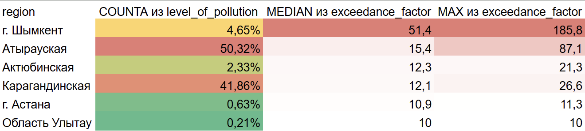

- После этого был составен анти-рейтинг регионов по показателю **ИЗА (Индекс загрязнения атмосферы, показывает уровень хронического, длительного загрязнения воздуха)**. Если сравнить таблицы по ИЗА и таблице с регионами, где постоянно собирают пробы качества воздуха, встают вопросы:

    - Почему в г. Астана так редко берут пробы воздуха, если она явно лидирует по ИЗА? 
    - Почему пробы по г. Алматы и Северо-Казахстанской области вообще не представлены?
    - С чем в таком случае связаны высокие показатели ИЗА, если в таблице с выбросами информации по этим регионам нет?

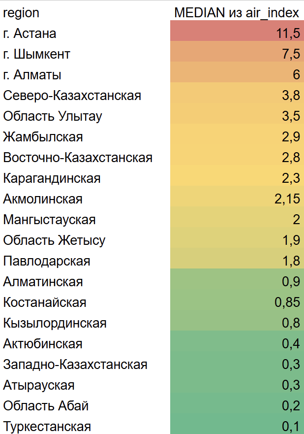

- Затем я проанализировалу частоту случаев **высокого и экстремально выского загрязнения поверхностных вод** регионов в 2024 году и вывела очередной анти-рейтинг. Стоит подчеркнуть, что в исходной таблице представлены данные по водным ресурсам только этих областей.

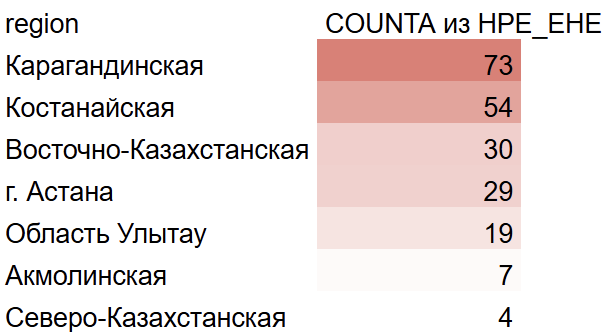

- Мне стало интересно, какие примеси чаще всего встречаются в водах регионов-антилидеров. Избыточное содержание в воде **марганца, марганца 2+ и железа** представляет серьезную опасность для здоровья человека. Марганец является нейротоксином. Длительное употребление воды с его высоким содержанием приводит к накоплению в печени, костях, почках, железах внутренней секреции и, что наиболее опасно, в головном мозге.

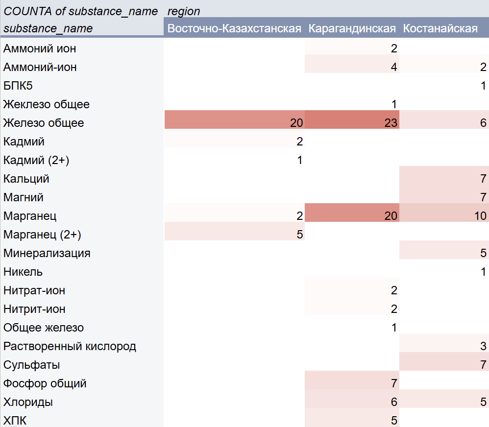

- После этого с помощью медианных значений я исследовала, **какие регионы лидеруют по количеству содержания свинца и хрома в почвах.** 

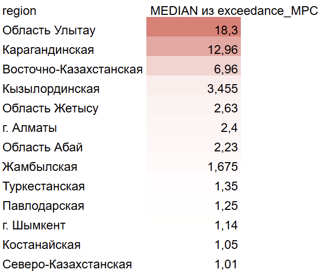

- Также выяснила, что наиболее радикальное загрязнение почв происходит в Восточно-Казахстанской области, из которой в таблице представлено всего два города. 

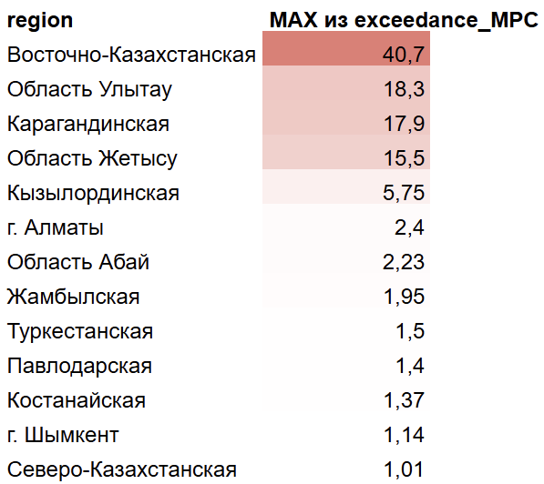

- Можно заметить, что сильнее всего загрязнению подвержены почвы **г. Риддера.**

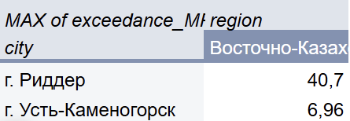

**В результате этого этапа выяснилось, что абсолютными антилидерами по загрязнению воздуха, вод и почвы явялются следующие регионы:**

- **Область Улытау**
- **Карагандинская область**
- **Восточно-Казахстанская область**
- **Костанайская область**
- **г. Астана**
- **г. Шымкент**
- **г. Алматы**
- **Северо-Казахстанская область**

***После этого этапа я перешла к анализу данных по заболеваемости, результаты которого будут отражены далее.***

## **📊Выводы**
1. Больше всего людей болеют онкологией в Северо-Казахстанской Восточно-Казахстанской, Карагандинской, Павлодарской и Костанайской областях. Абсолютными антилидерами являются Восточно-Казахстанская и Северо-Казахстанская области.

2. Чаще всего в Казахстане болеют онкологией кожи, губы, шейки матки и молочной железы. При этом их в <90% случаев выявляют на первых стадиях, в то время как онкологию трахеи, бронхов, легких и желудка заметно чаще диагностируют только на последней стадии болезни.

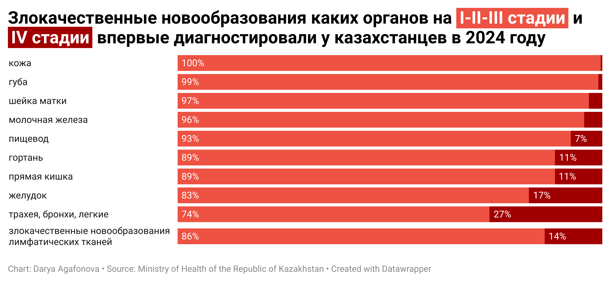
3. Судя по антилидерам из каждого соответствующего рейтинга, высокая степень загрязнения воздуха, воды и почв в 2024 году наблюдается в Области Улытау, Карагандинской, Восточно-Казахстанской, Костанайской, Северо-Казахстанской областях и в г. Астана, г. Шымкент, г. Алматы.

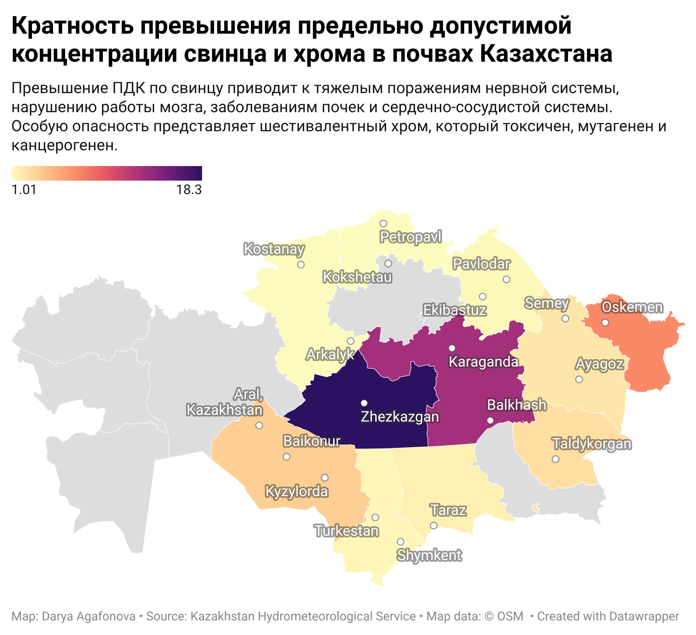

4. В регионах с самыми неблагоприятными экологическими условиями действительно наблюдается усиленный рост онкологических заболеваний: это можно увидеть в Восточно-Казахстанской, Северо-Казахстанской, Костанайской и Карагандинской областях. При этом нельзя сказать то же самое про г. Астана, г. Алматы и г. Шымкент, вероятно это связано с лучшей доступностью онкологической помощи в этих регионах.

5. В экологически неблагополучных регионах наблюдается более высокий уровень смертности. Это нельзя объяснить только тем, что в них больше болеющих людей, потому что, например, в Туркестанской области при довольно высоком показателе заболеваемости, уровень смертности является самым низким среди всех регионов.
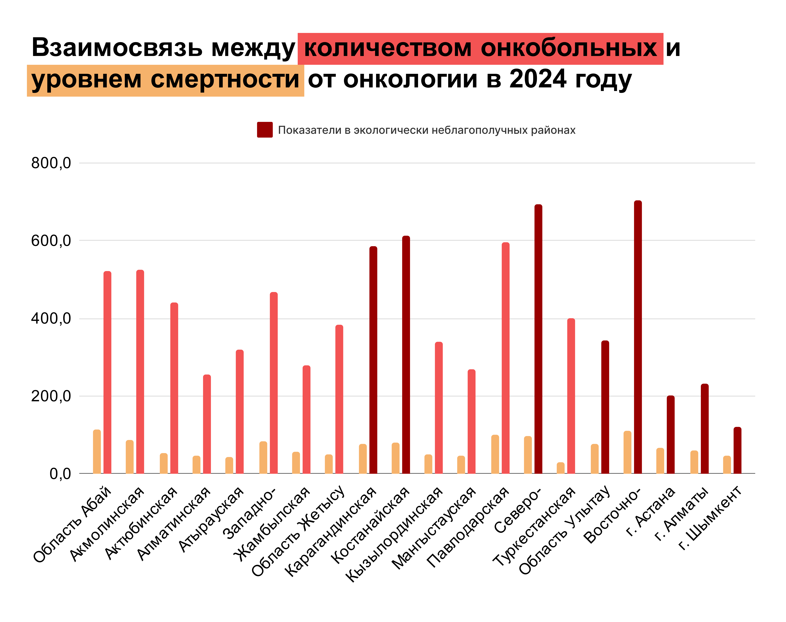

6. Нормальная степень обеспеченности онкологической помощью наблюдается в столице и городах республиканского значения: г. Астана, г. Алматы и г. Шымкент. При этом явно лидирует г. Алматы, что может говорить не только о большем количестве населения, но и о высокой развитости медицины в городе. В Восточно-Казахстанской области и области Улытау заметная нехватка медицинского оборудования и онкологов, что может свидетельствовать о том, что правительство не уделяет должного внимания этим регионам, экологическая ситуация которых является самой тяжелой.

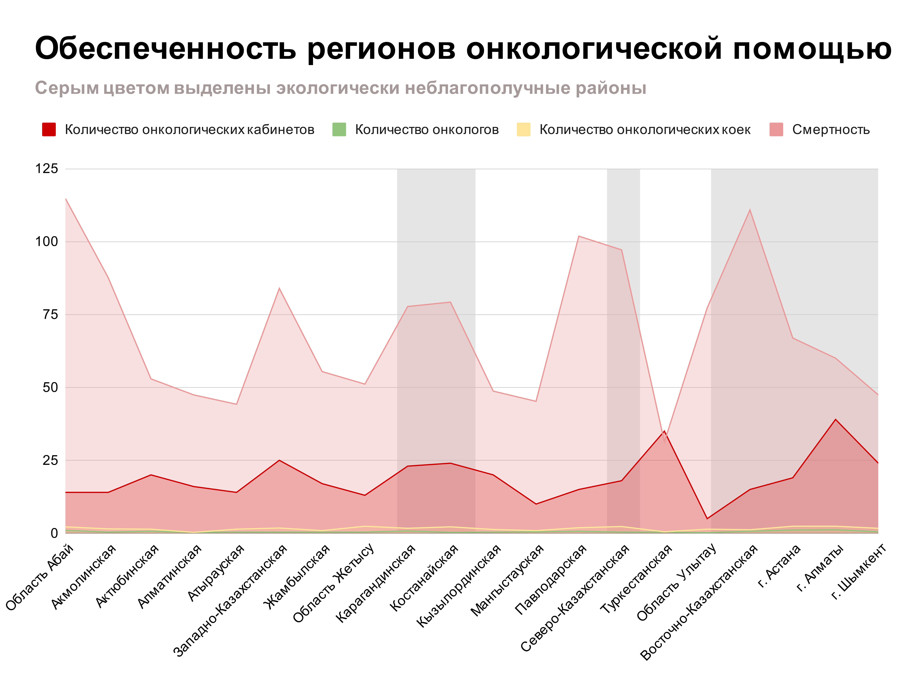

## **📍Референсы** 
- Data-driven исследование онкологии в России, проведенное командой [ЕСЛИ БЫТЬ ТОЧНЫМ](https://tochno.st/problems/oncology). Вдохновил всесторонний и серьезный подход к изучению заболеваемости онкологией в регионах, а также наглядные визуализации;
- Научные data-driven исследования, анализирующие взаимосвязь состояния экологии и заболеваемости онкологией:

    - [Эколого-эпидемиологическое сопряжение заболеваемости раком легкого с загрязнением канцерогенами атмосферного воздуха в регионах нефтехимического профиля](https://permmedjournal.ru/PMJ/article/view/9176/7385)
    - [Статистический анализ влияния выбросов в атмосферу загрязняющих веществ на заболеваемость злокачественными новообразованиями](https://moluch.ru/archive/437/95663).

## **🔧Инструменты**
В ходе выполнения проекта были использованы следующие инструменты:
- [iLovePDF](https://www.ilovepdf.com/ru) для конвертации необходимых страниц из документов в формат .xlsx;
- [Google таблицы](https://docs.google.com/spreadsheets/u/0/) для очистки и анализа данных, а также для их визуализации;
- [Datawrapper](https://www.datawrapper.de/) для визуализации данных;
- [Figma](https://www.figma.com/files/team/1432379859370218241/recents-and-sharing?fuid=1432379857855071089) для кастомизации визуализаций и редактирования наименований регионов;
- [Visual Studio Code](https://code.visualstudio.com/download) для создания и оформления репозитория;
- [GitHub](https://github.com/) для загрузки проекта.
